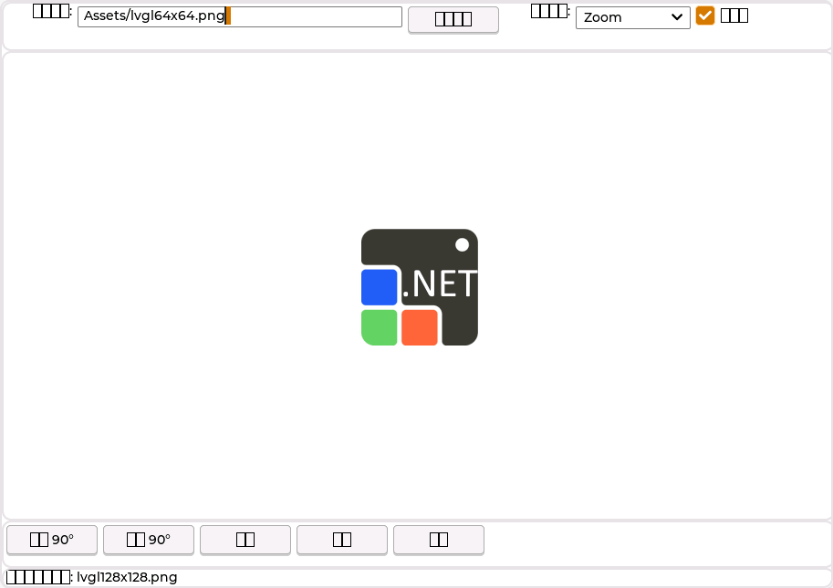
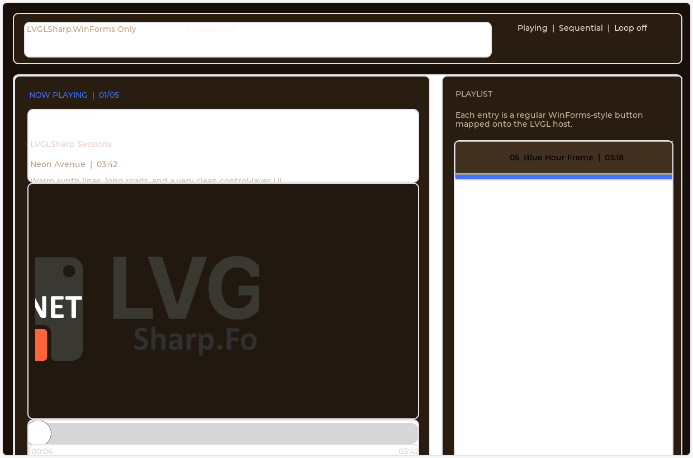
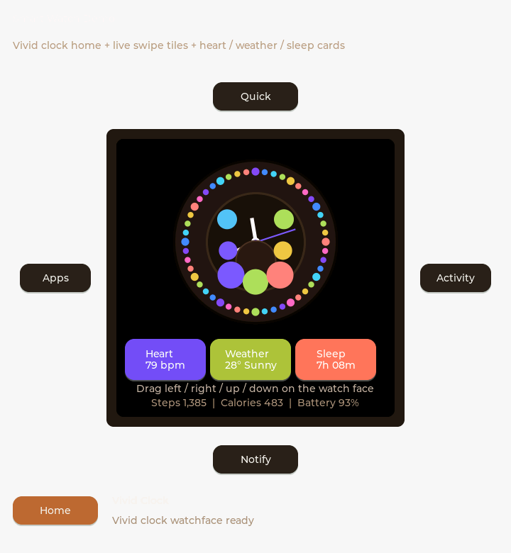
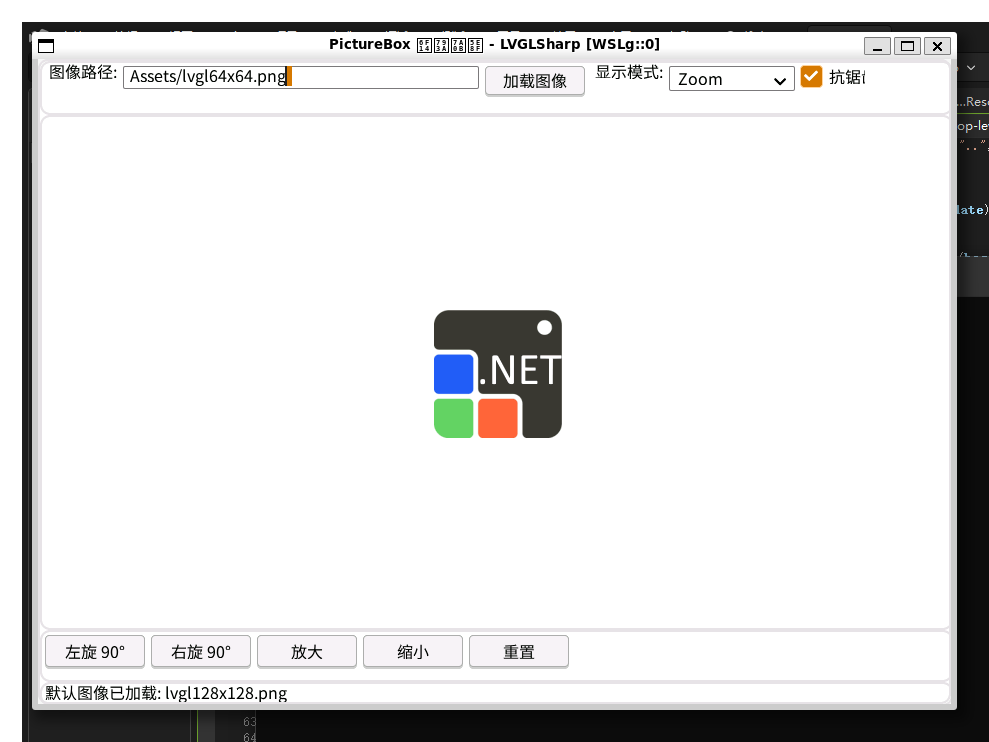
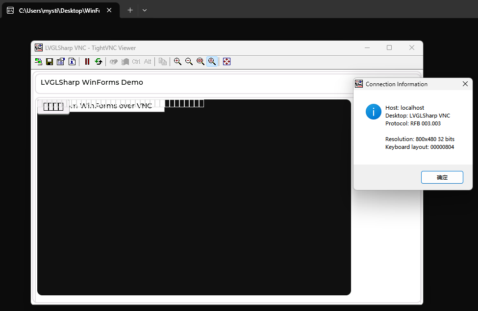

# LVGLSharp

中文 | [English](./README_en.md)

**LVGLSharp** 是一个基于 [LVGL](https://github.com/lvgl/lvgl) 的跨平台 WinForms 风格 UI 技术栈。面向应用开发时，主入口包是 `LVGLSharp.Forms`；其余库则分别承担运行时宿主、原生资产、底层绑定和辅助基础设施等职责。

当前仓库开发基线：`9.5.0.5`

- 文档：<https://lvglsharp.net/>
- 路线图：<https://github.com/IoTSharp/LVGLSharp/blob/main/ROADMAP.md>
- 变更日志：<https://github.com/IoTSharp/LVGLSharp/blob/main/CHANGELOG.md>

> 项目仍在快速演进中，暂不建议直接用于生产环境。

## 特性

- WinForms 风格 API 兼容：`Control`、`Form`、`Button`、`Label`、`TextBox`、`CheckBox`、`RadioButton`、`ComboBox`、`ListBox`、`PictureBox`、`Panel`、`GroupBox`、`FlowLayoutPanel`、`TableLayoutPanel`、`ProgressBar`、`TrackBar`、`NumericUpDown`、`RichTextBox` 等常用控件已具备可用基础。
- LVGL 全量互操作：`LVGLSharp.Interop` 通过 ClangSharpPInvokeGenerator 自动生成 P/Invoke 绑定，可直接访问 LVGL C API。
- 分层运行时：当前已经拆分出 Windows、Linux、Headless、macOS 与 Remote 等运行时包，现阶段稳定重点仍在 Windows、Linux 与 Headless 路径。
- NativeAOT 与原生库分发：支持 NativeAOT 发布，并通过 `LVGLSharp.Native` 提供多 RID 原生库与发布时目标文件。
- 自动运行时注册：引用运行时包后，`ApplicationConfiguration.Initialize()` 会通过 `buildTransitive` 完成平台注册。
- 跨平台绘图抽象：`LVGLSharp.Drawing` 提供 `Size`、`Point`、`Color` 等类型，不依赖 `System.Drawing`。

## 预览

以下预览图来自 `docs/images` 中已收录的部分运行效果截图。

<p align="center">
  
  
</p>

<p align="center">
  
  
</p>

<p align="center">
  
</p>

## 正式 NuGet 包

下表中的版本和下载量使用 NuGet 实时徽章展示，避免 README 再和实际发布状态脱节。

| NuGet 名称 | 版本 | 下载量 | 说明 |
|---|---|---|---|
| `LVGLSharp.Forms` | [](https://www.nuget.org/packages/LVGLSharp.Forms/) |  | 主应用入口包，提供 WinForms 风格 API 与运行时注册入口。 |
| `LVGLSharp.Core` | [](https://www.nuget.org/packages/LVGLSharp.Core/) |  | 共享运行时抽象、字体、诊断与宿主辅助能力。 |
| `LVGLSharp.Interop` | [](https://www.nuget.org/packages/LVGLSharp.Interop/) |  | 自动生成的 LVGL 底层 P/Invoke 绑定。 |
| `LVGLSharp.Native` | [](https://www.nuget.org/packages/LVGLSharp.Native/) |  | 多 RID 原生 LVGL 资产与发布时目标文件。 |
| `LVGLSharp.Runtime.Windows` | [](https://www.nuget.org/packages/LVGLSharp.Runtime.Windows/) |  | Windows 桌面运行时与 Win32 宿主支持。 |
| `LVGLSharp.Runtime.Linux` | [](https://www.nuget.org/packages/LVGLSharp.Runtime.Linux/) |  | Linux 运行时，覆盖 WSLg、X11、Wayland、SDL 与 FrameBuffer 路径。 |
| `LVGLSharp.Runtime.Headless` | [](https://www.nuget.org/packages/LVGLSharp.Runtime.Headless/) |  | 无头渲染、PNG 快照、回归验证与自动化运行时。 |
| `LVGLSharp.Runtime.MacOs` | [](https://www.nuget.org/packages/LVGLSharp.Runtime.MacOs/) |  | 早期 macOS 运行时包，已包含诊断与宿主骨架。 |
| `LVGLSharp.Runtime.Remote` | [](https://www.nuget.org/packages/LVGLSharp.Runtime.Remote/) |  | 远程会话抽象、帧传输与 VNC/RDP 相关运行时能力。 |

上面 9 个包当前都已经发布到 NuGet。仓库里另外还有几类辅助库，它们也需要理解，但不属于当前主发布流水线里的正式对外包。

## 仓库内附带库

| 库 | 状态 | 说明 |
|---|---|---|
| `LVGLSharp.Drawing` | 仓库辅助库 | 运行时与 UI 层共享的跨平台绘图基础类型。 |
| `LVGLSharp.WPF` | 实验性仓库库 | 基于 `LVGLSharp.Forms` 与 `LVGLSharp.Runtime.Windows` 的 WPF 风格启动与 XAML 运行时加载层。 |
| `LVGLSharp.Analyzers` | 由 `LVGLSharp.Forms` 携带 | 用于校验运行时包引用方式和仓库约束的 Roslyn 分析器。 |

`LVGLSharp.Forms` 已经会把分析器一并带入。一般应用只需要先选 `LVGLSharp.Forms`，再按目标宿主添加对应运行时包即可。

## 快速开始

### 1. 项目文件

推荐使用多目标框架，把 WinForms 设计器路径与 `LVGLSharp.Forms` 路径放在同一个工程里：

```xml
<PropertyGroup>
  <TargetFrameworks>net10.0-windows;net10.0</TargetFrameworks>
</PropertyGroup>

<PropertyGroup Condition="'$(TargetFramework)' == 'net10.0-windows'">
  <UseWindowsForms>true</UseWindowsForms>
</PropertyGroup>

<PropertyGroup Condition="'$(TargetFramework)' == 'net10.0'">
  <UseLVGLSharpForms>true</UseLVGLSharpForms>
  <PublishAot>true</PublishAot>
</PropertyGroup>

<ItemGroup Condition="'$(TargetFramework)' == 'net10.0'">
  <PackageReference Include="LVGLSharp.Forms" Version="*" />
  <PackageReference Include="LVGLSharp.Runtime.Windows" Version="*" />
  <PackageReference Include="LVGLSharp.Runtime.Linux" Version="*" />
</ItemGroup>
```

如果需要无头渲染、截图或自动化验证，再额外引用 `LVGLSharp.Runtime.Headless`。如果你是明确在探索远程渲染或 macOS 路径，再加入 `LVGLSharp.Runtime.Remote` 或 `LVGLSharp.Runtime.MacOs`。

### 2. 入口程序

`UseLVGLSharpForms=true` 的目标只需要正常调用 `ApplicationConfiguration.Initialize()`：

```csharp
ApplicationConfiguration.Initialize();
Application.Run(new MainForm());
```

### 3. 发布示例

```bash
dotnet publish -f net10.0 -r linux-arm64 -c Release
dotnet publish -f net10.0 -r linux-x64 -c Release
dotnet publish -f net10.0-windows -r win-x64 -c Release
```

## 当前运行时状态

| 方向 | 状态 | 说明 |
|---|---|---|
| WinForms API 兼容层 | 可用 | 核心控件、`Form` 生命周期与基础布局模式已经可用。 |
| Windows 运行时 | 可用 | 当前稳定路径之一。 |
| Linux `WSLg` / `X11` | 可用 | 当前桌面侧主路径。 |
| Linux `FrameBuffer` | 可用 | 当前设备侧主路径。 |
| Linux `Wayland` / `SDL` | 实验性 | 已实现，仍需更多验证与发布纪律。 |
| Headless `Offscreen` | 可用 | 已支持 PNG 快照、截图与回归测试入口。 |
| Linux `DRM/KMS` | 骨架中 | `DrmView` 已预留，原生后端待补齐。 |
| macOS 运行时 | 早期包边界 | 仓库与 NuGet 包中已有诊断、上下文与 surface/frame-buffer 骨架。 |
| Remote 运行时 | 早期包边界 | 已有 `VNC` / `RDP` 抽象、会话与 transport skeleton。 |

更完整的状态和下一阶段优先级见路线图。

## 交流

欢迎通过文档站、Issue 或微信群交流项目使用、跨平台适配与问题排查经验。


## 许可证

本项目基于 [MIT License](./LICENSE.txt) 开源。
