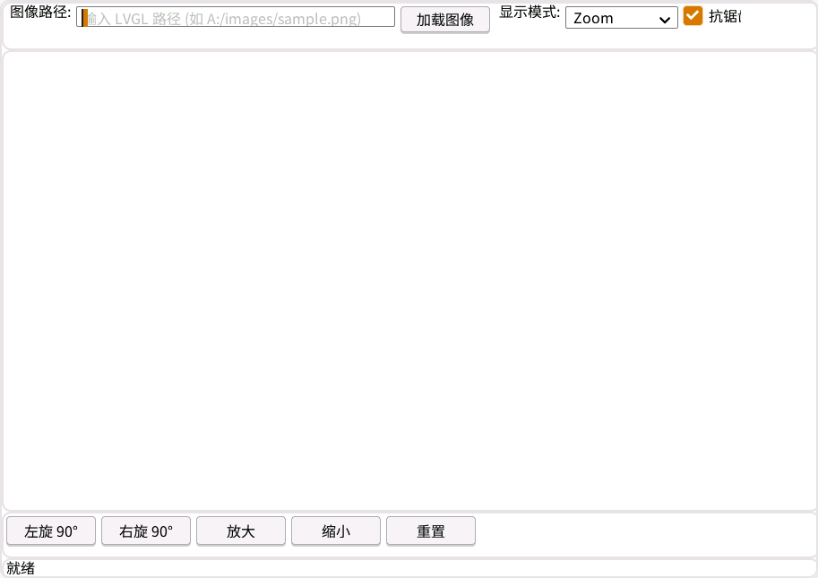

# PictureBox Demo

这是一个演示 `LVGLSharp.Forms.PictureBox` 控件功能的示例程序。

## 运行效果

下面的截图展示了 `PictureBoxDemo` 在 Linux 运行时中的界面效果：



## 功能展示

### 图像加载
- 支持从 LVGL 文件系统路径加载图像
- 输入路径格式: `A:/images/sample.png` 或 `S:/images/logo.png`

### 显示模式
- **Normal**: 原始大小，左上角对齐
- **StretchImage**: 拉伸以填充控件
- **AutoSize**: 调整控件大小以适应图像
- **CenterImage**: 居中显示
- **Zoom**: 缩放以适应，保持宽高比

### 图像变换
- **旋转**: 支持左旋和右旋，每次 90 度
- **缩放**: 支持放大和缩小，步进 20%
- **重置**: 恢复到初始状态（0 度，100% 缩放）

### 其他功能
- **抗锯齿**: 可选启用/禁用，提供更平滑的显示效果
- **实时状态**: 底部状态栏显示当前的显示模式、旋转角度、缩放比例和抗锯齿状态

## 使用说明

### 运行项目

#### 使用 Windows Forms (net10.0-windows)
```bash
dotnet run --framework net10.0-windows
```

#### 使用 LVGL (net10.0)
```bash
dotnet run --framework net10.0
```

### 操作步骤

1. **加载图像**
   - 在"图像路径"文本框中输入 LVGL 文件系统路径
   - 点击"加载图像"按钮

2. **调整显示模式**
   - 使用"显示模式"下拉列表选择不同的显示模式

3. **旋转图像**
   - 点击"◀ 左旋 90°"按钮逆时针旋转
   - 点击"右旋 90° ▶"按钮顺时针旋转

4. **缩放图像**
   - 点击"🔍+ 放大"按钮放大图像
   - 点击"🔍- 缩小"按钮缩小图像

5. **重置**
   - 点击"↺ 重置"按钮恢复到初始状态

6. **抗锯齿**
   - 勾选/取消勾选"抗锯齿"复选框

## 项目结构

```
PictureBoxDemo/
├── assets/
│   └── runtime-effect.png      # 运行效果截图
├── PictureBoxDemo.csproj      # 项目文件
├── Program.cs                  # 程序入口
├── frmPictureBoxDemo.cs        # 主窗体逻辑
├── frmPictureBoxDemo.Designer.cs  # 设计器生成代码
├── frmPictureBoxDemo.resx      # 窗体资源
├── sample.png                  # 示例图片（可选）
└── README.md                   # 本文件
```

## 注意事项

1. **图像路径**: 当前版本主要支持 LVGL 文件系统路径（如 `A:/`, `S:/`）。从常规文件系统加载图像的功能正在开发中。

2. **双目标框架**: 
   - `net10.0-windows`: 使用 Windows Forms 的 PictureBox
   - `net10.0`: 使用 LVGLSharp.Forms 的 PictureBox

3. **lvgl.dll**: 确保 `lvgl.dll` 在输出目录中（从 WinFormsDemo 复制）

4. **示例图片**: 如果有示例图片，请将其复制到项目目录

## 技术细节

### 缩放比例说明
- 256 = 100%（原始大小）
- 512 = 200%（放大 2 倍）
- 128 = 50%（缩小一半）
- 范围: 64 (25%) 到 2048 (800%)

### 旋转角度说明
- 范围: 0-360 度
- 每次旋转步进: 90 度
- 支持任意角度（通过代码）

## 相关文档

- [PictureBox 使用指南](../../../docs/PictureBox-Usage.md)
- [PictureBox 实现文档](../../../docs/PictureBox-Implementation.md)
- [完整示例代码](../../../docs/Examples/PictureBoxExample.cs)

## 扩展功能

可以扩展以下功能（需要修改代码）：

- 添加更多旋转角度选项（如 45 度）
- 添加图像翻转功能
- 添加图像滤镜效果
- 支持拖放图像文件
- 添加图像信息显示（尺寸、格式等）
- 实现图像浏览器功能

## 许可证

与 LVGLSharp 项目保持一致。
